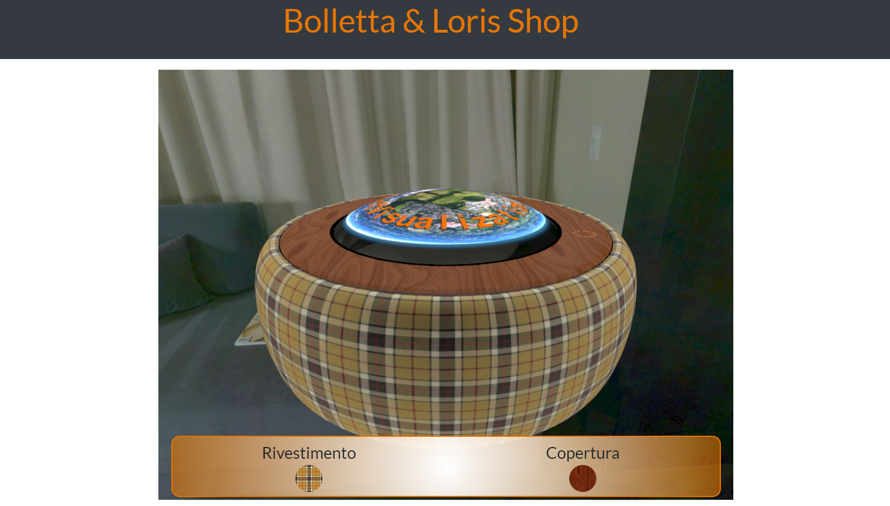
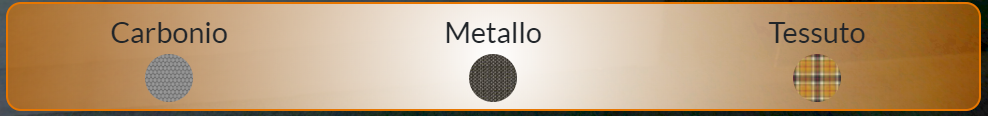
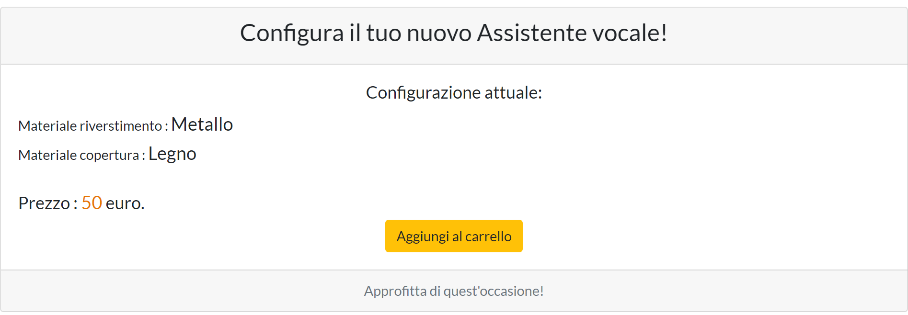

# Progetto Commercial Composer Bolletta & Parata
	

	
## Avvertenze
	E' necessario l'utilizzo di un web server per poter usufruire del funzionamento del productComposer
	
## Report

Il progetto propone un compositore online 3D di un oggetto in vendita, in questo caso si tratta di un impotetica nuova versione di assistente vocale ECHO DOT, presso un e-commerce, con la possibilità di scelta dei vari materiali e dei relativi colori che comporranno l'oggetto in fase di acquisto.

#### Interfaccia

L' interfaccia si compone di un menu centrale che permetterà di scegliere :
* la parte di superficie dell'oggetto 
	* il materiale del quale sarà composto
	* il colore del relativo materiale della 	superficie scelta
	
	
	

Con il mouse è possibile ruotare intorno all'oggetto, mentre con il touchpad è possibile effettuare uno zoom sull'oggetto. 

Nella seconda parte dell'interfaccia è possibile avere un resoconto delle scelte effettuate con la relativa variazione di prezzo secondo i materiali utilizzati per comporre l'oggetto.

#### BRDF Implementate:
	
* Production Friendly Microfacet Sheen BRDF per la distribuzione del colore dei tessuti
(http://www.aconty.com/pdf/s2017_pbs_imageworks_sheen.pdf)

* BRDF di Burley della Disney
(https://disney-animation.s3.amazonaws.com/library/s2012_pbs_disney_brdf_notes_v2.pdf)

* Riflessione tramite algoritmo SmithGGXSchlickVisibility

#### journal

* 04/01/20:
	* Progettazione idea e disegno iniziale dell'oggetto da modellare con Blender;  
	* Inizio modellazione oggetto dell' e-commerce;
	
* 05/01/20:
	* Modellazione dell'oggetto e caricamento tramite OBJLoader;
	* Codifica Menu di interazione con l'oggetto con l'utilizzo del framework Bootstrap

* 07/01/20:
	* Implemetazione shader con l'utilizzo della BRDF di base 
	* Collegamento dell'interfaccia utente con l'oggetto modellato

* 08/01/20:
	* Implemetazione  BRDF Dinsey  
		* aggiunta luci tipo set fotografico per l'illuminazione completa dell'oggetto 
	* Implementazione luce ambientale con l'utilizzo della Cubemap

* 09/01/20
	* Implementazione della BRDF per la simulazione dei tessuti
	* Miglioramento menu di interazione
	* Ottimizzazioni immagini per texture e del codice di shading

* 13/01/20
	* Implementazione dell'interfaccia di resoconto dei materiali scelti per la composizione
	* Total responsive interface
	* Impaginazione del product composer per e-commerce
* 14/01/20
	* Modulazione del codice con suddivisione del HTML e degli script JS
	
 	
#### Programmi e tecnologie utilizzate 

* immagini e texture Paint.net ver: 4.205  
* Visual Studio Code 1.41.1  
* editor di testo Notepad++ ver: 7.7.1  
* server Web Apache ver: 2.4  
* Modellazione 3D Blender ver: 2.8
* Bootstrap 4.3.1
* HTML 5
* CSS3
* PHP 7.1

Software realizzato in Team con [Loris Parata](https://github.com/LorisParata98)
